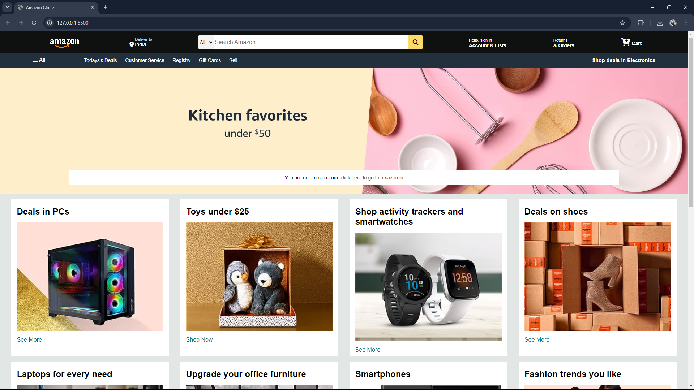

# Amazon Clone

This repository contains the source code for an Amazon clone built using HTML and CSS. The clone replicates the basic structure and styling of the Amazon website.

## Table of Contents

- [Project Overview](#project-overview)
- [Features](#features)
- [Technologies Used](#technologies-used)
- [Installation](#installation)
- [Usage](#usage)
- [Screenshots](#screenshots)
- [Contributing](#contributing)
- [License](#license)
- [Contact](#contact)

## Project Overview

The Amazon clone is a front-end project that aims to mimic the appearance and functionality of the Amazon website. This project is designed to enhance skills in HTML and CSS, focusing on responsive design and layout.

## Features

- Responsive design
- Home page with product listings
- Header with search bar and navigation links
- Footer with additional information links

  ## Screenshot



## Technologies Used

- HTML
- CSS

## Installation

To get a local copy up and running, follow these simple steps:

1. Clone the repository
   ```sh
   git clone https://github.com/himanshu-Bisht-Web-dev/amazon_clone.git

## Contact
For any inquiries, please contact your-himanshubisht599@gmail.com.
